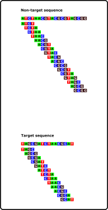

# KEC Manual

[Introduction](#introduction)  
[Principle of operation](#principle-of-operation)  
[Installation](#installation)  
[Command-line parameters](#command-line-parameters)  
[K-mer size selection](#k-mer-size-selection)  
[Input and output data](#input-and-output-data)  
[Memory tests](#memory-tests)  
[Speed tests](#speed-tests)  
<!--
[Citation](#citation)  
-->

## Introduction
KEC *(short for K-mer exclusion by crossreference)* was designed to search for unique DNA / RNA / amino acid sequences in large datasets. The original aim was to find unique sites to design (PCR / LAMP etc.) primers for specific detection of bacteria. It takes **target** and **non-target** genomes and by crossreferencing of the respective K-mers it reconstructs sequences that are unique for **target** genome(s).

!!!NOT FOR UNASSEMBLED READS <<---

## Principle of operation
In general, KEC is designed to use **target** and **non-target** genomes to find unique sequences in **target**. The principle of KEC algorithm can be devided into 3 main stages: **K-mer creation**, **crossreferencing of the K-mers** and **merging surviving K-mers into longer sequences**.

In the first stage all input sequences (both target and non-target) are used to create K-mers by sliding windows approach.

>K-mer size is a mandatory parameter and its selection is discussed in a  [separate section](#k-mer-size-selection).

## Installation
KEC does not require installation. Binary executables for **Windows**, **Linux** and **macOS** can be downloaded from Releases section. After download and extraction the software works in any directory. During download and first run the software can be marked by antivirus as harmul. However, if downloaded from this repository, the program only works as stated, without any malicious activity or data collection. Users may inspect and compile from source code, if security is a concern.

## Command-line parameters
KEC has two modes of operation - **exclude** and **include**. Each mode has its own set of parameters accessible by `-h` or `--help` parameter (e.g. `kec.exe exclude -h`).

### exclude mode
- `-t` - Add target sequence(s). Fasta formatted file or whole directory is allowed.
- `-n` - Add nontarget sequence(s). Fasta formatted file or whole directory is allowed.
- `-o` - Output path to store resulting fasta formatted file.
- `-k` - K-mer size. Explained in separate section [K-mer size selection](#k-mer-size-selection). *Default = 12*.
- `-r` - Also exclude reverse complements of the sequences. Takes more (approx. 2 - 3x) time to finish. *Default = false*.
- `--min` - Minimum size of resulting sequence. *Default = 13*.
- `--max` - Maximum size of resulting sequence (0 = unlimited). *Default = 0*.
- `--help`, `-h` - Show help message.

**Example:**

`kec.exe exclude -t c:\seqs\target -n c:\seqs\nontarget -o c:\seqs\results\test.fasta -k 12 --min 200`

Will search for unique sequences in fasta formatted files located in `c:\seqs\target` by comparing them to non-target sequences in `c:\seqs\nontarget`. K-mer size will be 12 and minimal length of recovered sequences will be 200.

### include mode
- `-m` - Add master sequence(s). Fasta formatted file or whole directory is allowed.
- `-p` - Add pool sequence(s) to include in consensus sequence. Fasta formatted file or whole directory is allowed.
- `-o` - Output path to store resulting fasta formatted file.
- `-k` - K-mer size. Explained in separete section [K-mer size selection](#k-mer-size-selection). *Default = 12*.
- `--min` - Minimum size of resulting sequence. *Default = 13*.
- `--max` - Maximum size of resulting sequence (0 = unlimited). *Default = 0*.
- `--help`, `-h` - Show help message.

**Example:**

`kec.exe include -m c:\seqs\master\master.fasta -n c:\seqs\nontarget -o c:\seqs\results\test.fasta -k 12 --min 200`

Will search for common sequences in fasta formatted file `c:\seqs\master\master.fasta` by comparing them to pool sequences located in directory `c:\seqs\pool`. K-mer size will be 12 and minimal length of recovered sequences will be 200.

## K-mer size selection
The selection of K-mer size depends on many factors and it will be different for different datasets. There are, however, general rules for K-mer size selection for each mode of operation.

### exclude mode
With higher K-mer size, number and size of the resulting sequences increase. Because a lower K-mer size means that at least 1  [K-mer size] nucleotide is different from nontarget sequences, we usually want to find the lowest K-mer size that produces any results. We usually do that by starting at a number around 12 and increase or decrease the number until the lowest number producing more than 0 sequences is found.

### include mode
Lower K-mer size usually results in fewer sequences which usually tend to be longer, and conversely, higher K-mer size usually results in higher number but shorter sequences. Furthermore, be aware that lower K-mer size means higher chance the sequence is merged with K-mers that are present in the pool sequences, but from various positions. We usually select K-mer size by starting at a number around 15 and raise the number until the resulting sequence count no longer increases by much.

## Input and output data
KEC currently works only with fasta formated files on both input and output. To work with other formats (e.g. fastq) the file has to be converted to fasta first by any available tool. KEC also accepts whole directory as an input, where files with extensions `.fasta` `.fna`, `.ffn`, `.faa` and `.frn` are used. Direct support for other formats will be added in future versions.

## Memory tests

## Speed tests

<!--
## Citation
If you used KEC for your work, please cite our article:

**Beran P.**, **Stehlíková D.**, **Cohen S.P.**, **Čurn V.** (2021) KEC: Unique sequence search by K-mer exclusion. *Bioinformatics*. **UNDER REVIEW**.
-->