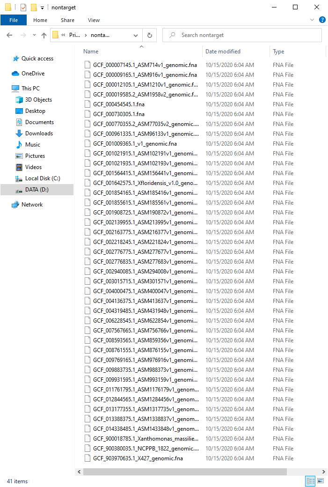
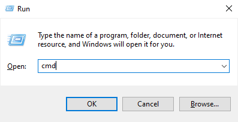
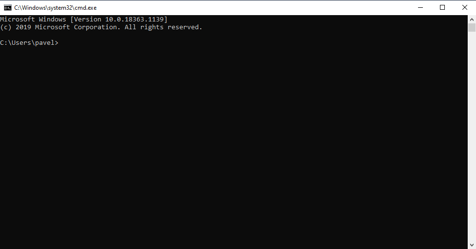
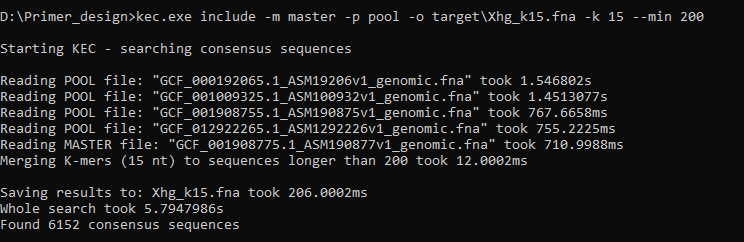
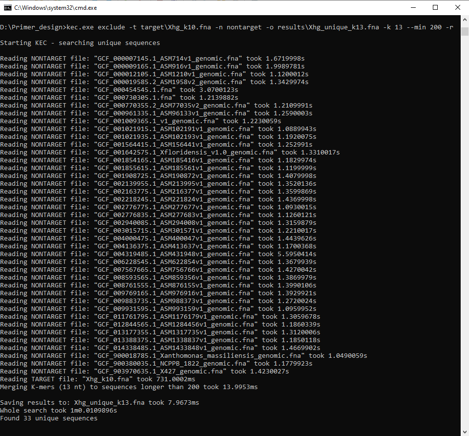
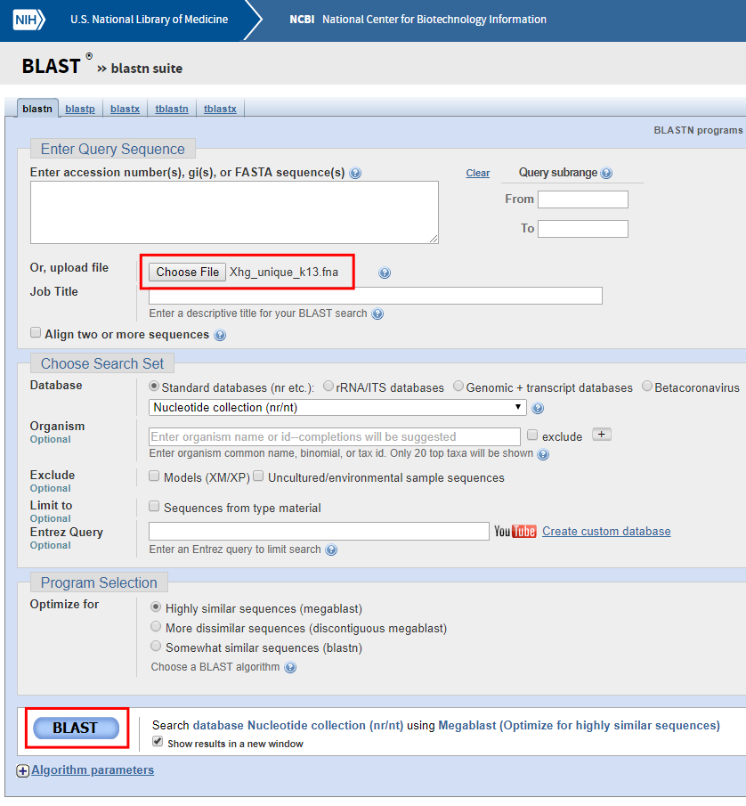
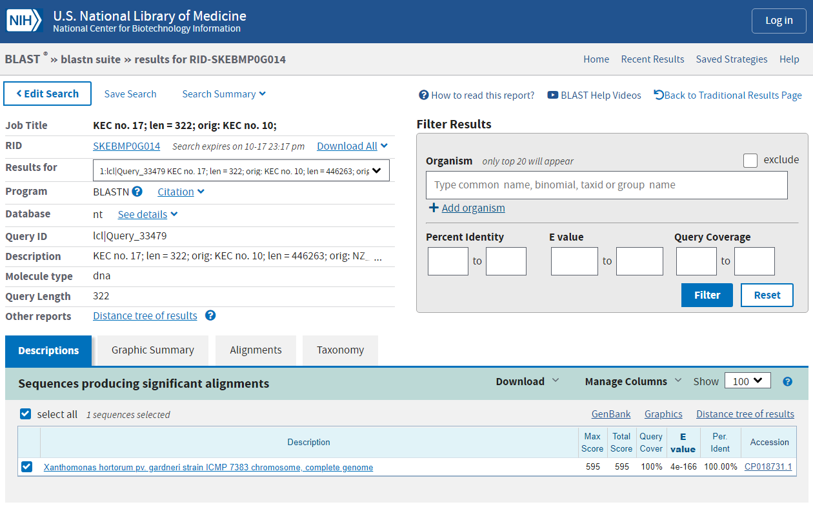

# KEC Tutorial

This tutorial is to show how KEC can be easily used for finding unique sequences suitable for the design of (PCR) primers for detection of specific bacteria by providing target and non-target genomes from online sources. In this case, sequences will be found for *Xanthomonas hortorum* pv. *gardneri* (target bacterial phytopathogen), NCBI database will be used as the source for genomic data, and all operations will be done in the Windows operating system. 

This tutorial provides only one of the many use cases of the KEC software, which can be adapted to any specific need of identifying unique sequences. Furthermore, this tutorial aims to show how to use the software from a technical point of view without consideration of the biological aspect.

1. First, create a directory structure in your computer. It is not strictly necessary to use this structure, but we will use it for clarity. The base directory, where all files will be downloaded and analyzed, will be   `D:\Primer_design`. On your computer, you can use any other directory on any drive but remember to replace it to match your directory structure.
    1. Create a new directory on drive `D:` named `Primer_design`
    2. In `D:\Primer_design` create the following directories:
        - `master`
        - `pool`
        - `target`
        - `nontarget`
        - `results`

2. Download KEC from <https://github.com/berybox/KEC/releases>. The program is a standalone executable and does not require installation. It can be placed in any directory on the computer. For simplicity, in this tutorial, the program will be placed in our base directory `D:\Primer_design`. The directory structure should now look similar to this:

 

> NOTE: During the download or after the first launch of the program, you can get antivirus warnings stating that the program may be harmful. However, if downloaded from the mentioned official website, the program only works as stated, without any malicious activity or data collection. Users may inspect and compile from source code, available at <https://github.com/berybox/KEC>, if security is a concern.

3. Download genomic data from the NCBI (or any other) database. KEC currently only reads `FASTA` formatted files.
    1. In your web browser, go to <https://www.ncbi.nlm.nih.gov>
    2. Put *Xanthomonas hortorum* pv. *gardneri* to the search box and click `Search` 
    
    

    3. On the next page click `Assembly`
    
    
    
    4. Click the checkboxes of all assemblies you want to use as a target for your primer design (1). In this tutorial, we will use assembly numbers 1 to 5. Then click `Download Datasets` (2) on the right
    5. In the popup window, make sure that only `Genomic Sequence (FASTA)` checkbox is checked (3) and click `Download` (4) 
    
    
    
    6. A `.ZIP` file of the dataset will be downloaded to your computer
    7. Clicking the downloaded zip file should open it in File Explorer. Then navigate to `ncbi_dataset` and `data`. You should see five directories, each containing a `FASTA` (`.FNA` extension in this case) file with one of the assemblies 
    
    
    
    8. Navigate to the directory with a file that will be used as a master sequence (in this case `GCF_001908775.1` and copy the `.FNA` file to the directory `master` in the base directory (i.e. `D:\Primer_design\master`) 
    
    
    
    9. Copy the other four assemblies to the `D:\Primer_design\pool` in the same way, so the directory `pool` will contain four `.FNA` files 
    
    

    10. Repeat steps `3.i.` to `3.vi.` to obtain non-target assemblies and extract all FNA files to “D:\Primer_design\nontarget”. For this tutorial, we chose 41 assemblies from related xanthomonads and other related bacteria
    
    

    11. At this point, we should have one file in `master` directory, four in `pool` and 41 in `nontarget`

4. Use KEC to obtain sequences common to target genomes
    1. Press `Windows key + R` to open Run window, type `cmd` and click OK

    

    2. The Windows command line window will open

    

    3. Write the following commands to navigate to the base directory:
        ```
        D:
        cd \Primer_design
        ```
    4. Here you can get program usage information by writing `kec.exe`, `kec.exe include` or `kec.exe exclude`
    5. Type the following command to obtain sequences that are present in all target assemblies:
        ```
        kec.exe include -m master -p pool -o target\Xhg_k15.fna -k 15 --min 200
        ```
        Parameters explanation:

        **include** - Keep only K-mers that are present in any of the sequences from the pool

        **-m master** – Points to the directory containing the master sequence(s). You can also specify the file directly (e.g. by `-m d:\Primer_design\master\GCF_001908775.1_ASM190877v1_genomic.fna`)

        **-p pool** – Similar to the above, pointing to the directory with the pool of sequences to be compared with master

        **-o target\Xhg_k15.fna** – file name with a path to store results

        **-k 15** – K-mer size to use for comparison. Explanation below

        **--min 200** – Minimum size of sequence to keep. We choose 200, because shorter sequences are generally not well suited for primer design


        You should see following output:
    

    6. A new file named `Xhg_k15.fna` was created by KEC in `D:\Primer_design\target`. You can repeat step `4.v.` multiple times to obtain different results. In general, considerations for selecting K-mer size are as follows:Lower K-mer size usually results in fewer sequences which usually tend to be longer, and conversely, higher K-mer size usually results in higher number but shorter sequences. Furthermore, be aware that lower K-mer size means higher chance the sequence is merged with K-mers that are present in the pool sequences, but from various positions. We usually select K-mer size by starting at a number around 15 and raise the number until the resulting sequence count no longer increases by much

5. Use KEC to obtain sequences unique to target genomes. Write the following command to obtain sequences that are assumed to be unique for target genomes:
    ```
    kec.exe exclude -t target\Xhg_k10.fna -n nontarget -o results\Xhg_unique_k13.fna -k 13 --min 200 -r
    ```
    Parameters explanation:

    **exclude** – Keep only K-mers that are NOT present in any of the sequences from nontarget
    
    **-t target\Xhg_k10.fna** – Points to the file containing target sequences from step 4
    
    **-n nontarget** – Points to the directory with nontarget sequences to be compared with target
    
    **-o results\Xhg_unique_k13.fna** – file name with a path to store results
    
    **-k 13** – K-mer size to use for comparison. Explanation below
    
    **--min 200** – minimum size of the sequence to keep. We choose 200, because shorter sequences are generally not well suited for primer design
    
    **-r** – compare also reverse complements of the sequences. This option takes approximately 2 – 3x more time
    You should see the following output:
    
    

    A new file named `Xhg_unique_k13.fna` was created by KEC in `D:\Primer_design\results`. You can repeat step 5 multiple times to obtain different results. For K-mer exclusion, the principle of choosing K-mer size is different from inclusion. With higher K-mer size, number and size of the resulting sequences increase. Because a lower K-mer size means that at least 1 $\div$ [K-mer size] nucleotide is different from nontarget sequences, we usually (for primer design) want to find the lowest K-mer size that produces any results. We usually do that by starting at a number around 12 and increase or decrease the number until the lowest number producing more than 0 sequences is found

6. Check the results by BLAST (NCBI)
    1. The file `d:\Primer_design\results\Xhg_unique_k13.fna` contains 33 sequences that are assumed to be unique for *Xanthomonas hortorum* pv. *gardneri*
    2. Open web browser and navigate to the nucleotide BLAST website: <https://blast.ncbi.nlm.nih.gov/Blast.cgi?PROGRAM=blastn&PAGE_TYPE=BlastSearch>
    3. Click on the `Choose File` button and find the `Xhg_unique_k13.fna` in your computer
    4. Click on `BLAST` button

    

    5. Wait for the results. The search can take from several seconds to several minutes
    6. After the search is complete, you should see a page similar to this:

    

    7. Here you can review all of the 33 sequences, whether they seem to be unique for the target
    8. You can repeat step 6 with any other database within NCBI or elsewhere
    9. If a recurring nontarget organism is present in the results, its sequence can be easily downloaded to `nontarget` directory and steps 5 and 6 can be repeated until desirable results are produced

7. After a thorough review of the sequences, you can use them for primer design with any favorite tool like PrimerExplorer, Primer3, Primer-BLAST, etc. Detailed primer design is outside the scope of this tutorial